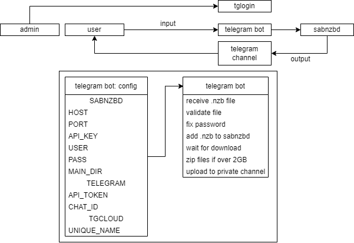

# nzbtg
A telegram bot to download .nzb files and upload them into a channel.

## Usage
1. Create a Telegram Bot using @BotFather, [instructions here](https://gist.github.com/slowptr/50d88d919085e81dada576b3c954a463)
2. Setup [tgcloud](https://github.com/iw4p/telegram-cloud) (best to follow his instructions ^^)
3. Build nzbtg using ```go build``` inside the src directory
4. Start it once to create the default config.ini
5. Fill out the config.ini
6. Run ```./nzbtg```

---

## A small idea of how it could work upfront



---
